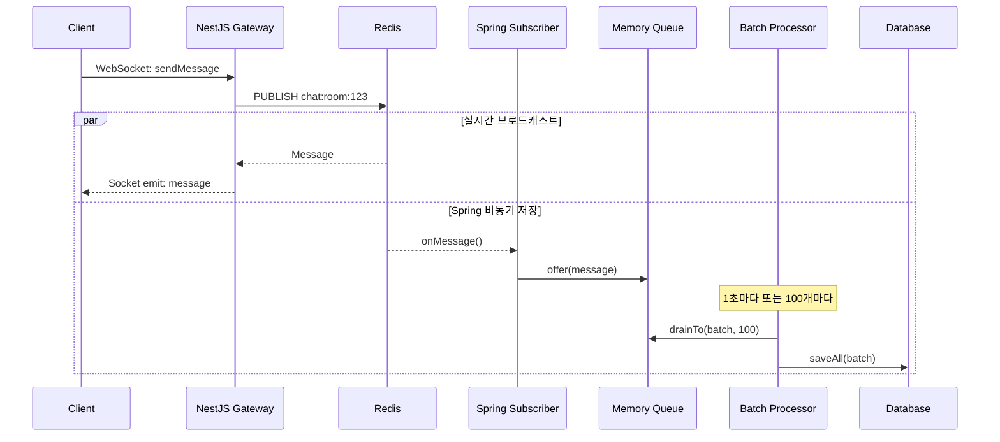

# 🔧 Spring 서버 WebSocket 채팅 통합 가이드

## 📋 개요

API Gateway에서 **Socket.io + VP 인증** 기반 WebSocket 채팅을 구축했습니다.
Spring 서버는 **Redis Subscriber + Memory Queue + Batch 저장** 방식으로 통합됩니다.

---

## 🏗️ 아키텍처

```
Client (Socket.io)
    ↓ WebSocket (VP Token)
API Gateway (NestJS)
    ↓
Redis Pub/Sub ←───────────┐
    ↓                     │
모든 클라이언트            │ subscribe
(실시간 수신)             │
                          │
                    Spring Server
                          ↓
                   Memory Queue
                   (LinkedBlockingQueue)
                          ↓
                    Batch Processor
                   (1초 or 100개마다)
                          ↓
                         DB
```

### 역할 분담

| 컴포넌트 | 역할 |
|---------|------|
| **Client** | Socket.io로 실시간 메시지 송수신 |
| **API Gateway** | VP 인증, WebSocket 관리, Redis publish |
| **Redis Pub/Sub** | 메시지 브로커 (이벤트 버스) |
| **Spring Server** | Redis 구독 → Memory Queue → Batch DB 저장 |

---

## 🔨 Spring 서버 구현 사항

### ✅ 핵심 개념

**이벤트 기반 아키텍처 (Event-Driven)**
1. NestJS는 메시지를 Redis에 **publish만**
2. Spring은 Redis를 **subscribe**하여 수신
3. Memory Queue에 **버퍼링**
4. **Batch 처리**로 DB 저장 (성능 최적화)

---

### 1. Redis Subscriber 구현

#### 📍 `ChatMessageSubscriber.java` - Redis 메시지 수신

```java
package kpaas.dogcat.domain.chat.subscriber;

import com.fasterxml.jackson.databind.ObjectMapper;
import kpaas.dogcat.domain.chat.dto.ChatReqDTO.ChatMessageReqDTO;
import lombok.RequiredArgsConstructor;
import lombok.extern.slf4j.Slf4j;
import org.springframework.data.redis.connection.Message;
import org.springframework.data.redis.connection.MessageListener;
import org.springframework.stereotype.Component;

import java.util.concurrent.BlockingQueue;
import java.util.concurrent.LinkedBlockingQueue;

/**
 * Redis Pub/Sub Subscriber
 * - NestJS에서 발행한 메시지 수신
 * - Memory Queue에 추가하여 Batch 처리
 */
@Slf4j
@Component
@RequiredArgsConstructor
public class ChatMessageSubscriber implements MessageListener {

    // 메모리 큐 (최대 10,000개 버퍼링)
    private static final BlockingQueue<ChatMessageReqDTO> messageQueue =
        new LinkedBlockingQueue<>(10000);

    private final ObjectMapper objectMapper;

    @Override
    public void onMessage(Message message, byte[] pattern) {
        try {
            String channel = new String(message.getChannel());
            String body = new String(message.getBody());

            log.debug("Received message from channel: {}", channel);

            // JSON → DTO 변환
            ChatMessageReqDTO chatMessage = objectMapper.readValue(
                body,
                ChatMessageReqDTO.class
            );

            // Memory Queue에 추가
            boolean added = messageQueue.offer(chatMessage);

            if (!added) {
                log.error("Message queue is FULL! Message dropped: {}", chatMessage);
                // TODO: 메시지 손실 방지 (DB 직접 저장 또는 알림)
            } else {
                log.debug("Message queued: roomId={}, sender={}",
                    chatMessage.getRoomId(),
                    chatMessage.getChatSenderId()
                );
            }

        } catch (Exception e) {
            log.error("Failed to process message: {}", e.getMessage(), e);
        }
    }

    // Memory Queue getter (Batch Processor에서 사용)
    public static BlockingQueue<ChatMessageReqDTO> getMessageQueue() {
        return messageQueue;
    }
}
```

---

### 2. Batch Processor 구현

#### 📍 `ChatMessageBatchProcessor.java` - 배치 저장

```java
package kpaas.dogcat.domain.chat.batch;

import kpaas.dogcat.domain.chat.dto.ChatReqDTO.ChatMessageReqDTO;
import kpaas.dogcat.domain.chat.entity.ChatMessage;
import kpaas.dogcat.domain.chat.repository.ChatMessageRepository;
import kpaas.dogcat.domain.chat.subscriber.ChatMessageSubscriber;
import lombok.RequiredArgsConstructor;
import lombok.extern.slf4j.Slf4j;
import org.springframework.scheduling.annotation.Scheduled;
import org.springframework.stereotype.Component;
import org.springframework.transaction.annotation.Transactional;

import java.util.ArrayList;
import java.util.List;
import java.util.concurrent.BlockingQueue;

/**
 * Batch Message Processor
 * - 1초마다 또는 100개마다 DB 저장
 * - 성능 최적화: Bulk Insert
 */
@Slf4j
@Component
@RequiredArgsConstructor
public class ChatMessageBatchProcessor {

    private final ChatMessageRepository chatMessageRepository;
    private static final int BATCH_SIZE = 100;

    /**
     * 1초마다 또는 100개 메시지마다 Batch 저장
     */
    @Scheduled(fixedDelay = 1000) // 1초마다 실행
    @Transactional
    public void processBatch() {
        BlockingQueue<ChatMessageReqDTO> queue = ChatMessageSubscriber.getMessageQueue();

        if (queue.isEmpty()) {
            return; // 큐가 비어있으면 스킵
        }

        List<ChatMessageReqDTO> batch = new ArrayList<>();
        queue.drainTo(batch, BATCH_SIZE); // 최대 100개 가져오기

        if (batch.isEmpty()) {
            return;
        }

        try {
            // DTO → Entity 변환
            List<ChatMessage> entities = batch.stream()
                .map(this::toEntity)
                .toList();

            // Bulk Insert
            chatMessageRepository.saveAll(entities);

            log.info("✅ Saved {} messages to DB (Batch)", entities.size());

        } catch (Exception e) {
            log.error("❌ Failed to save batch messages: {}", e.getMessage(), e);

            // 실패한 메시지 다시 큐에 추가 (재시도)
            batch.forEach(msg -> {
                try {
                    queue.put(msg);
                } catch (InterruptedException ie) {
                    Thread.currentThread().interrupt();
                    log.error("Failed to re-queue message: {}", msg);
                }
            });
        }
    }

    /**
     * DTO → Entity 변환
     */
    private ChatMessage toEntity(ChatMessageReqDTO dto) {
        return ChatMessage.builder()
            .roomId(dto.getRoomId())
            .chatSenderId(dto.getChatSenderId())
            .message(dto.getMessage())
            .isRead(false)
            .build();
    }
}
```

---

### 3. Redis Configuration 수정

#### 📍 `RedisConfig.java` - Redis Subscriber 등록

```java
package kpaas.dogcat.global.redis;

import kpaas.dogcat.domain.chat.subscriber.ChatMessageSubscriber;
import lombok.RequiredArgsConstructor;
import org.springframework.context.annotation.Bean;
import org.springframework.context.annotation.Configuration;
import org.springframework.data.redis.connection.RedisConnectionFactory;
import org.springframework.data.redis.listener.ChannelTopic;
import org.springframework.data.redis.listener.RedisMessageListenerContainer;
import org.springframework.data.redis.listener.adapter.MessageListenerAdapter;

@Configuration
@RequiredArgsConstructor
public class RedisConfig {

    private final ChatMessageSubscriber chatMessageSubscriber;

    /**
     * Redis Message Listener Container
     * - chat:room:* 채널 구독
     */
    @Bean
    public RedisMessageListenerContainer redisMessageListenerContainer(
        RedisConnectionFactory connectionFactory
    ) {
        RedisMessageListenerContainer container = new RedisMessageListenerContainer();
        container.setConnectionFactory(connectionFactory);

        // chat:room:* 패턴 구독
        container.addMessageListener(
            messageListenerAdapter(),
            new ChannelTopic("chat:room:*") // 모든 방 구독
        );

        return container;
    }

    /**
     * Message Listener Adapter
     */
    @Bean
    public MessageListenerAdapter messageListenerAdapter() {
        return new MessageListenerAdapter(chatMessageSubscriber);
    }
}
```

---

### 4. DTO 수정

#### 📍 `ChatReqDTO.java` - NestJS 메시지 형식 맞추기

```java
package kpaas.dogcat.domain.chat.dto;

import lombok.AllArgsConstructor;
import lombok.Data;
import lombok.NoArgsConstructor;
import com.fasterxml.jackson.annotation.JsonProperty;

@Data
@AllArgsConstructor
@NoArgsConstructor
public class ChatReqDTO {

    /**
     * NestJS에서 전송하는 메시지 형식
     * {
     *   "messageId": 1697532345678,
     *   "roomId": 123,
     *   "senderId": "0xAbC123...",
     *   "senderName": "0xAbC123...",
     *   "message": "안녕하세요!",
     *   "isRead": false,
     *   "createdAt": "2025-10-17T12:34:56.789Z"
     * }
     */
    @Data
    @AllArgsConstructor
    @NoArgsConstructor
    public static class ChatMessageReqDTO {
        @JsonProperty("messageId")
        private Long messageId; // 임시 ID (Spring에서 무시)

        @JsonProperty("roomId")
        private Long roomId;

        @JsonProperty("senderId")
        private String chatSenderId;

        @JsonProperty("senderName")
        private String senderName; // 임시 닉네임 (Spring에서 실제 값으로 대체 가능)

        @JsonProperty("message")
        private String message;

        @JsonProperty("isRead")
        private Boolean isRead;

        @JsonProperty("createdAt")
        private String createdAt;
    }

    // 기존 DTO는 유지
    @Data
    @AllArgsConstructor
    public static class ChatRoomCreateDTO {
        private String adoptWriterId;
        private Long adoptId;
        private String roomName;
    }
}
```

---

### 5. 스케줄링 활성화

#### 📍 `Application.java` - @EnableScheduling 추가

```java
package kpaas.dogcat;

import org.springframework.boot.SpringApplication;
import org.springframework.boot.autoconfigure.SpringBootApplication;
import org.springframework.scheduling.annotation.EnableScheduling;

@SpringBootApplication
@EnableScheduling // ⭐ Batch Processor 활성화
public class DogcatApplication {
    public static void main(String[] args) {
        SpringApplication.run(DogcatApplication.class, args);
    }
}
```

---

## 🔄 메시지 흐름



---

## 📊 성능 최적화

### 1. **메모리 큐 크기 조정**
```java
// 10,000개 → 큰 트래픽에는 증가
private static final BlockingQueue<ChatMessageReqDTO> messageQueue =
    new LinkedBlockingQueue<>(10000);
```

### 2. **배치 크기 조정**
```java
// 100개 → 성능에 맞게 조정
private static final int BATCH_SIZE = 100;
```

### 3. **스케줄 간격 조정**
```java
// 1초 → 더 빠르게 (500ms) 또는 느리게 (2초)
@Scheduled(fixedDelay = 1000)
```

---

## 🔒 메시지 손실 방지

### 문제: Redis Pub/Sub는 구독자가 없으면 메시지 사라짐

### 해결책 (선택)

#### Option 1: Redis Streams 사용
```java
// Redis Streams: 메시지 보장 (ACK 필요)
@Bean
public StreamMessageListenerContainer<String, MapRecord<String, String, String>>
    streamListener(RedisConnectionFactory factory) {
    // ...
}
```

#### Option 2: 큐 Full 시 DB 직접 저장
```java
boolean added = messageQueue.offer(chatMessage);
if (!added) {
    // 큐가 Full → DB에 직접 저장
    chatMessageRepository.save(toEntity(chatMessage));
}
```

---

## 🧪 테스트 가이드

### 1. Redis 실행
```bash
redis-server
```

### 2. Spring 서버 실행
```bash
./gradlew bootRun
```

### 3. 로그 확인
```
✅ Saved 100 messages to DB (Batch)
📥 Received message from channel: chat:room:123
```

### 4. DB 확인
```sql
SELECT COUNT(*) FROM chat_message WHERE created_at > NOW() - INTERVAL 1 MINUTE;
```

---

## 📌 중요 사항

### ✅ 반드시 구현해야 할 것
1. ✅ `ChatMessageSubscriber` - Redis 구독
2. ✅ `ChatMessageBatchProcessor` - Batch 저장
3. ✅ `RedisConfig` - Listener 등록
4. ✅ `@EnableScheduling` 활성화

### ⚠️ 선택사항
- ❓ Redis Streams (메시지 손실 방지)
- ❓ 닉네임 조회 로직 (DB 또는 Redis 캐시)
- ❓ 메트릭 수집 (큐 크기, 처리 속도)

### 🚫 변경하지 않아도 되는 것
- ✅ 기존 채팅방 REST API
- ✅ 채팅 DB 스키마
- ✅ STOMP WebSocket (완전 제거 가능)

---

## 🔗 관련 파일

### Spring Server
```
src/main/java/kpaas/dogcat/
├── domain/chat/
│   ├── subscriber/
│   │   └── ChatMessageSubscriber.java    # ⭐ 새로 추가
│   ├── batch/
│   │   └── ChatMessageBatchProcessor.java # ⭐ 새로 추가
│   ├── dto/
│   │   └── ChatReqDTO.java               # 수정
│   └── repository/
│       └── ChatMessageRepository.java
└── global/redis/
    └── RedisConfig.java                  # 수정

application.yml                            # Redis 설정 확인
```

---

## 💡 문제 해결

### Q1: 메시지가 DB에 저장되지 않습니다
**A:**
1. Redis가 실행 중인지 확인
2. `@EnableScheduling` 추가했는지 확인
3. 로그에서 "Saved X messages to DB" 확인

### Q2: 메시지가 누락됩니다
**A:**
1. Memory Queue 크기 증가 (10000 → 50000)
2. Redis Streams 사용 고려
3. 큐 Full 시 DB 직접 저장 로직 추가

### Q3: 성능이 느립니다
**A:**
1. Batch 크기 증가 (100 → 500)
2. 스케줄 간격 감소 (1000ms → 500ms)
3. DB 인덱스 확인 (room_id, created_at)

---

## 📞 연락처

- **API Gateway 개발자:** [담당자 이름]
- **이슈 트래킹:** GitHub Issues

---

## 🎉 구현 완료 체크리스트

- [ ] `ChatMessageSubscriber.java` 작성
- [ ] `ChatMessageBatchProcessor.java` 작성
- [ ] `RedisConfig.java` 수정
- [ ] `ChatReqDTO.java` 수정
- [ ] `@EnableScheduling` 추가
- [ ] Redis 실행 확인
- [ ] 테스트: 메시지 전송 → DB 저장 확인

Good luck! 🚀
