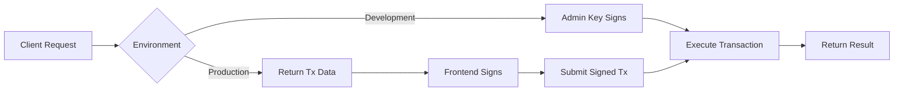

# Guardian Service - 블록체인 연동 가이드

## 환경 설정

### 개발 모드 (Development)
`.env` 파일에 관리자 프라이빗 키 추가:
```env
NODE_ENV=development
ADMIN_PRIVATE_KEY=0x여기에_테스트용_프라이빗_키
```

### 프로덕션 모드 (Production)
```env
NODE_ENV=production
# ADMIN_PRIVATE_KEY는 설정하지 않음 (사용자 지갑 서명 사용)
```

## 사용 방법

### 1. 개발 모드 (자동 서명)

개발 환경에서는 ADMIN_PRIVATE_KEY로 자동 서명합니다:

```typescript
// 바로 트랜잭션 실행
const result = await guardianService.registerGuardian(
  '0x123...', // guardianAddress
  'hash123',  // personalDataHash
  'ipfs://...', // ncpStorageURI
  1 // verificationMethod
);

console.log(result);
// { success: true, txHash: '0x...', blockNumber: 123 }
```

### 2. 프로덕션 모드 (사용자 지갑 서명)

#### Step 1: 트랜잭션 데이터 준비
```typescript
// 서명할 트랜잭션 데이터 받기
const result = await guardianService.registerGuardian(
  '0x123...',
  'hash123',
  'ipfs://...',
  1
);

console.log(result);
// {
//   requiresSignature: true,
//   transactionData: {
//     to: '0xGuardianRegistry...',
//     data: '0x...',
//     from: '0x123...',
//     gasLimit: 300000n
//   },
//   message: 'Please sign this transaction with your wallet'
// }
```

#### Step 2: 프론트엔드에서 MetaMask로 서명
```javascript
// Frontend (React/Vue/etc)
const signer = await provider.getSigner();
const signedTx = await signer.signTransaction(transactionData);
```

#### Step 3: 서명된 트랜잭션 제출
```typescript
// 서명된 트랜잭션 전송
const result = await guardianService.registerGuardian(
  '0x123...',
  'hash123',
  'ipfs://...',
  1,
  signedTx // 서명된 트랜잭션 추가
);

console.log(result);
// { success: true, txHash: '0x...', blockNumber: 123 }
```

## API 메서드

### 쓰기 작업 (서명 필요)
- `registerGuardian()` - 보호자 등록
- `updateGuardianData()` - 보호자 정보 업데이트
- `linkPet()` - 펫 연결
- `unlinkPet()` - 펫 연결 해제
- `verifyGuardian()` - 보호자 검증 (관리자만)

### 읽기 작업 (서명 불필요)
- `getGuardianProfile()` - 프로필 조회
- `getGuardianPets()` - 펫 목록 조회
- `getVerificationProof()` - 검증 정보 조회
- `getTotalGuardians()` - 전체 보호자 수
- `isGuardianRegistered()` - 등록 여부 확인

## 트랜잭션 흐름



## 에러 처리

- 개발 모드에서 ADMIN_PRIVATE_KEY가 없으면 에러
- 프로덕션 모드에서 서명 없이 트랜잭션 실행 시도하면 트랜잭션 데이터만 반환
- 관리자 권한이 필요한 작업은 ADMIN_PRIVATE_KEY 필수