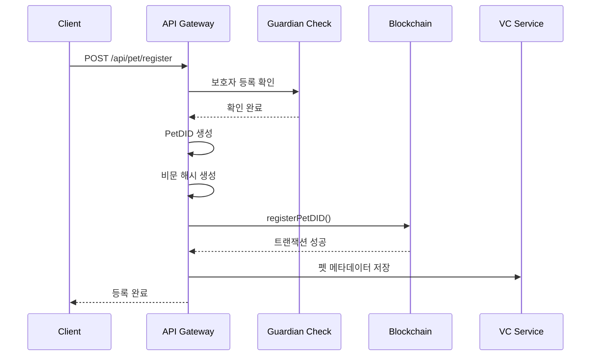
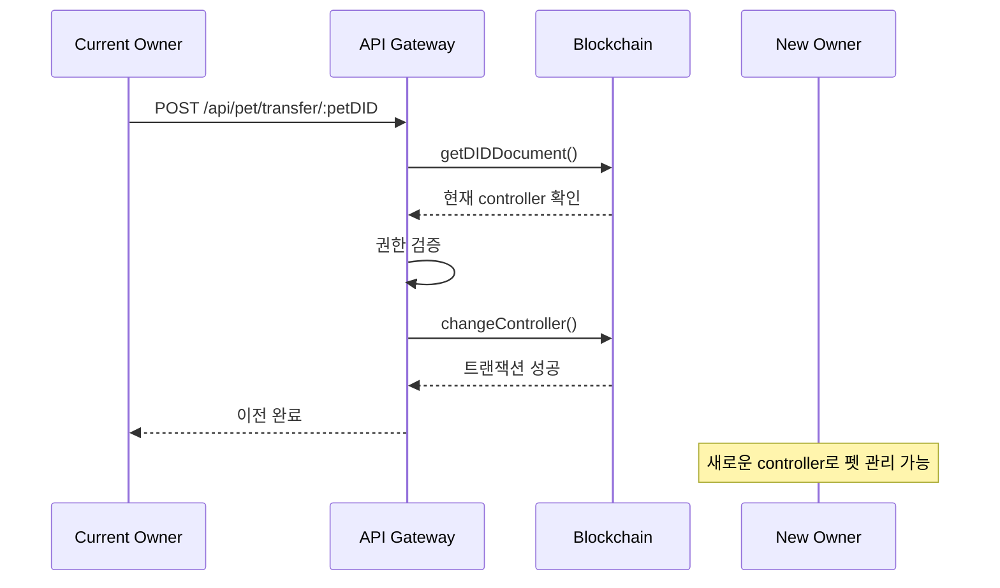

# Pet Service - 블록체인 연동 가이드

## 개요

Pet 서비스는 PetDID Registry 스마트 컨트랙트와 연동하여 반려동물의 DID(Decentralized Identifier)를 관리합니다.

## 주요 기능

### 1. PetDID 등록
- 보호자만 펫을 등록할 수 있습니다
- 비문 데이터(Biometric)를 블록체인에 저장
- DID 형식: `did:pet:ethereum:{chainId}:{petId}`

### 2. 비문 검증
- ML 모델 서버를 통한 비문 검증
- 유사도 기반 인증/식별

### 3. 소유권 이전
- Controller(보호자) 변경 가능
- 입양, 양도 등의 시나리오 지원

## API 엔드포인트

### POST /api/pet/register
펫 등록 (보호자 인증 필요)

**Request Body:**
```json
{
  "species": "dog",
  "name": "뽀삐",
  "age": 3,
  "gender": "male",
  "breed": "골든 리트리버",
  "color": "golden",
  "weight": 25.5,
  "biometricData": {
    "features": [0.1, 0.2, 0.3, ...]
  },
  "modelServerReference": "model-server-v1.0",
  "sampleCount": 5,
  "microchipId": "900123456789012",
  "metadata": {
    "vaccinations": ["rabies", "distemper"],
    "allergies": []
  }
}
```

**Response:**
```json
{
  "success": true,
  "petDID": "did:pet:ethereum:1337:0x...",
  "txHash": "0x...",
  "blockNumber": 123,
  "biometricHash": "0x...",
  "message": "Pet registered successfully"
}
```

### GET /api/pet/:petDID
펫 정보 조회

**Response:**
```json
{
  "success": true,
  "petDID": "did:pet:ethereum:1337:0x...",
  "biometricOwner": "0x...",
  "controller": "0x...",
  "created": 1234567890,
  "updated": 1234567890,
  "exists": true,
  "biometric": {
    "featureVectorHash": "0x...",
    "modelServerReference": "model-server-v1.0",
    "sampleCount": 5,
    "registrationTime": 1234567890
  }
}
```

### GET /api/pet/my/pets
내 펫 목록 조회 (인증 필요)

**Response:**
```json
{
  "success": true,
  "guardian": "0x...",
  "pets": [
    "did:pet:ethereum:1337:0x...",
    "did:pet:ethereum:1337:0x..."
  ],
  "totalPets": 2
}
```

### GET /api/pet/by-controller/:address
보호자별 펫 목록 조회

**Response:**
```json
{
  "success": true,
  "controller": "0x...",
  "pets": ["did:pet:ethereum:1337:0x..."],
  "totalPets": 1
}
```

### POST /api/pet/transfer/:petDID
펫 소유권 이전 (현재 보호자만 가능)

**Request Body:**
```json
{
  "newController": "0x...",
  "reason": "Adoption"
}
```

**Response:**
```json
{
  "success": true,
  "txHash": "0x...",
  "blockNumber": 124,
  "message": "Pet ownership transferred"
}
```

### POST /api/pet/verify-biometric/:petDID
비문 검증

**Request Body:**
```json
{
  "similarity": 95,
  "purpose": 0,
  "modelServerSignature": "0x..."
}
```

**Response:**
```json
{
  "success": true,
  "isValid": true,
  "petDID": "did:pet:ethereum:1337:0x...",
  "similarity": 95,
  "purpose": 0
}
```

### GET /api/pet/stats/total
전체 펫 수 조회

**Response:**
```json
{
  "success": true,
  "totalPets": 42
}
```

### GET /api/pet/check/:petDID
펫 등록 여부 확인

**Response:**
```json
{
  "success": true,
  "petDID": "did:pet:ethereum:1337:0x...",
  "isRegistered": true
}
```

## 플로우

### 1. 펫 등록 플로우



### 2. 소유권 이전 플로우



## 환경 설정

### 개발 모드
`.env`:
```env
NODE_ENV=development
ADMIN_PRIVATE_KEY=0x... # 테스트용 프라이빗 키
CHAIN_ID=1337
PET_DID_REGISTRY_ADDRESS=0x...
```

### 프로덕션 모드
`.env`:
```env
NODE_ENV=production
CHAIN_ID=1
PET_DID_REGISTRY_ADDRESS=0x...
# ADMIN_PRIVATE_KEY는 설정하지 않음
```

## 비문 데이터 구조

### ML 서버 연동 (예정)
```typescript
interface BiometricData {
  features: number[];      // Feature vector from ML model
  modelVersion: string;    // ML 모델 버전
  captureDevice: string;   // 촬영 디바이스 정보
  captureDate: string;     // 촬영 일시
  quality: number;         // 이미지 품질 점수 (0-100)
}
```

## 에러 처리

### Guardian not registered
```json
{
  "success": false,
  "error": "Guardian registration required. Please register as a guardian first."
}
```

### Pet DID not found
```json
{
  "success": false,
  "error": "Pet DID not found"
}
```

### Unauthorized transfer
```json
{
  "success": false,
  "error": "Only current controller can transfer pet ownership"
}
```

## 테스트

### Postman으로 테스트
```bash
# 1. 펫 등록
POST http://localhost:3000/api/pet/register
Headers:
  walletaddress: 0x... (보호자 주소)
Body:
{
  "species": "dog",
  "name": "뽀삐"
}

# 2. 내 펫 조회
GET http://localhost:3000/api/pet/my/pets
Headers:
  walletaddress: 0x...

# 3. 펫 정보 조회
GET http://localhost:3000/api/pet/{petDID}
```

## 주의사항

1. **보호자 등록 필수**: 펫을 등록하기 전에 먼저 보호자로 등록되어야 합니다
2. **PetDID 고유성**: 각 펫은 고유한 DID를 가집니다
3. **비문 데이터 보안**: 비문 원본은 저장하지 않고 해시만 저장합니다
4. **소유권 이전**: 현재 controller만 소유권을 이전할 수 있습니다
5. **개발 모드**: ADMIN_PRIVATE_KEY로 자동 서명하여 테스트가 용이합니다

## 향후 개선 사항

- [ ] ML 서버와 실제 연동
- [ ] 비문 이미지 업로드 API
- [ ] 펫 건강 기록 관리
- [ ] 백신 접종 기록
- [ ] 보험 연동
- [ ] 유실/발견 신고 시스템